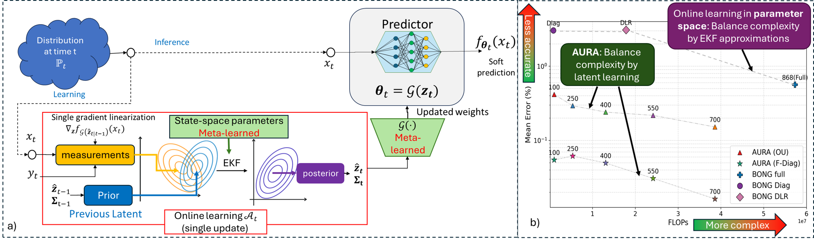
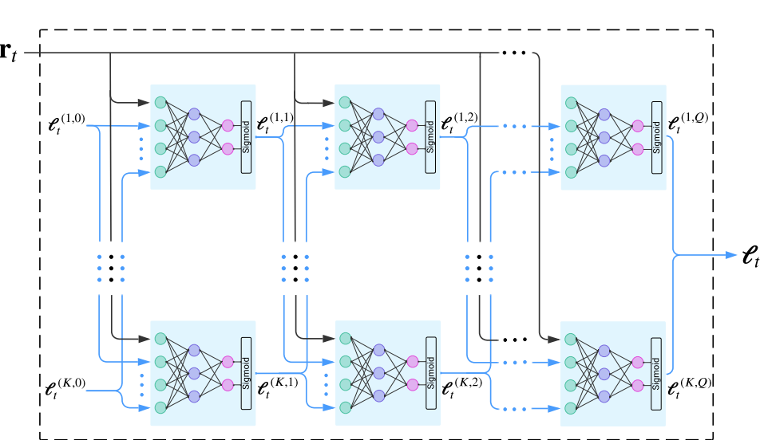

# AURA Neural Receiver

This repository accompanies the paper **“Online Learning via Learned Latent Bayesian Tracking”** and contains the implementation of the wireless neural receiver experiments.

The image adaptation experiments are maintained in a separate repository:  
https://github.com/aura-online-adaptation/AURA-Image-Adaptation

---

## What is AURA?

**AURA** (*Adaptive Update through Representation Adaptation*) is a meta-learned Bayesian online adaptation framework for non-stationary environments.

Instead of applying Bayesian filtering directly in the full neural receiver parameter space, AURA learns a compact latent state-space representation offline. During deployment, online adaptation is performed by an extended Kalman filtering-style Bayesian update in the learned latent space, followed by reconstruction of the full receiver parameters through a learned lifting map.

This enables fast and stable receiver adaptation under time-varying wireless channels while keeping the online Bayesian update computationally efficient.

---

## Method Illustration

<p align="center">
  
</p>

---

## Repository Overview

```text
.
├── BONG_torch_version/     # Bayesian online tracking and latent-state update modules
├── experiments/            # Experiment data, runners, configurations, plotting, and saved results
├── Flops_calculation/      # FLOPs and computational-complexity estimation utilities
├── src/                    # Core wireless receiver and channel implementation
└── README.md
```

### Bayesian online tracking

`BONG_torch_version/` contains the PyTorch implementation of the Bayesian Online Natural Gradient update modules used in AURA, including latent-space Bayesian updates, block-wise variants, and state-space prediction models.

### Experiment framework

`experiments/` contains the framework used to reproduce the wireless receiver experiments, including data utilities, experiment runners, configuration handling, plotting scripts, and saved results.

Main experiment files:

```text
experiments/framework/single_run.py              # Runs one online experiment
experiments/framework/multi_runner.py            # Runs an online sweep
experiments/framework/projection_learning.py     # Learns projection / latent-space parameters offline
experiments/framework/run_offline_then_online.py # Runs offline learning followed by online evaluation
experiments/framework/plot_maker.py              # Collects results and generates plots/tables
experiments/framework/read_config.py             # Loads and validates JSON configs
```

Main configuration files:

```text
experiments/framework/single_config.json # Single online run configuration
experiments/framework/sweep_config.json  # Multi-run / sweep configuration
experiments/framework/proj_config.json   # Offline projection-learning configuration
```

### Neural receiver implementation

`src/` contains the core wireless communication and neural receiver implementation:

- `src/channel/` – modulation utilities and uplink MIMO channel loading/generation.
- `src/Detector/` – detector architectures, including DeepSIC blocks, full DeepSIC detectors, and ResNet-based components.
- `src/Pulse/` – latent-to-parameter projection modules, including linear and DNN-based lifting maps.
- `src/training_algo/` – general online adaptation methods such as Online GD.
- `src/Utils/` – general utilities used across the receiver and experiment pipeline.

---

## Model Architecture

The wireless receiver experiments use **DeepSIC** (*Deep Soft Interference Cancellation*) as the base neural receiver. DeepSIC is an iterative multi-user MIMO detector that refines each user’s symbol estimate by combining the received signal with soft interference estimates from the other users.

In this work, AURA adapts the DeepSIC receiver online by tracking a learned low-dimensional latent representation of its parameters, rather than updating the full parameter space directly.

<p align="center">
  
</p>

<sup>Note: The codebase also contains ResNet-based detector components, but the wireless receiver experiments reported in the paper use DeepSIC.</sup>

---

## Installation

All commands below are written for **Windows CMD** and should be executed from the repository root unless stated otherwise.

Clone the repository:

```cmd
git clone https://github.com/aura-online-adaptation/AURA-Neural-Receiver.git
cd AURA-Neural-Receiver
```

### Option 1: Conda installation

Create and activate the Conda environment:

```cmd
conda env create -f environment.yml
conda activate aura_receiver
```

### Option 2: pip / venv installation

Create a local virtual environment:

```cmd
python -m venv .venv
.venv\Scripts\activate
python -m pip install --upgrade pip
pip install -r requirements.txt
```

### Option 3: Conda with pip requirements

```cmd
conda create -n aura_receiver python=3.11
conda activate aura_receiver
pip install -r requirements.txt
```

### PyTorch note

The default setup is intended for CPU execution. If GPU support is required, install the CUDA-enabled PyTorch build that matches your CUDA version according to the official PyTorch installation instructions.

### Quick sanity check

From the repository root, verify that the main experiment modules can be imported:

```cmd
python -c "from experiments.framework.single_run import run_experiment; print('single_run import OK')"
python -c "from experiments.framework.projection_learning import train_projection; print('projection_learning import OK')"
python -c "from experiments.framework.multi_runner import run_multi_sweep; print('multi_runner import OK')"
```

If these commands pass, the environment is ready for running the experiment scripts below.

---

## Important Windows CMD Note

Do **not** copy Linux-style line continuations using `\` into Windows CMD.

For example, this is a Linux/bash command style and should **not** be pasted into CMD:

```bash
python -m experiments.framework.multi_runner \
  --config_path experiments/framework/sweep_config.json \
  --output_dir experiments/data/results/multi_test
```

In Windows CMD, use a single-line command instead:

```cmd
python -m experiments.framework.multi_runner --config_path experiments/framework/sweep_config.json --output_dir experiments/data/results/multi_test
```

If the project is executed from `.venv`, either activate it first:

```cmd
.venv\Scripts\activate
```

or call the environment Python explicitly:

```cmd
.venv\Scripts\python.exe -m experiments.framework.multi_runner --config_path experiments/framework/sweep_config.json --output_dir experiments/data/results/multi_test
```

---

## Running Experiments

All commands below should be executed from the repository root.

### 1. Single online experiment

Run a single online evaluation using `single_config.json`:

```cmd
python -m experiments.framework.single_run --config_path experiments/framework/single_config.json
```

To explicitly choose where results are saved:

```cmd
python -m experiments.framework.single_run --config_path experiments/framework/single_config.json --output_dir experiments/data/results/single_test
```

With `.venv` explicitly:

```cmd
.venv\Scripts\python.exe -m experiments.framework.single_run --config_path experiments/framework/single_config.json --output_dir experiments/data/results/single_test
```

---

### 2. Multiple online experiments / sweeps

Run an online sweep using `sweep_config.json`:

```cmd
python -m experiments.framework.multi_runner --config_path experiments/framework/sweep_config.json --output_dir experiments/data/results/multi_test --num_runs 1 --run_start 1
```

Before running a full sweep, use `--dry_run` to verify the generated configurations:

```cmd
python -m experiments.framework.multi_runner --config_path experiments/framework/sweep_config.json --output_dir experiments/data/results/multi_test --num_runs 1 --run_start 1 --dry_run
```

With `.venv` explicitly:

```cmd
.venv\Scripts\python.exe -m experiments.framework.multi_runner --config_path experiments/framework/sweep_config.json --output_dir experiments/data/results/multi_test --num_runs 1 --run_start 1
```

The multi-runner can be used in two modes:

1. **Standalone mode** – evaluates online configurations using the artifact path specified in the config.
2. **Offline-integrated mode** – called by the offline-then-online runner and receives the learned artifact directory directly from the offline stage.

---

### 3. Offline latent-space learning

Run offline learning of the latent projection and prediction parameters:

```cmd
python -m experiments.framework.projection_learning --config_path experiments/framework/proj_config.json
```

With `.venv` explicitly:

```cmd
.venv\Scripts\python.exe -m experiments.framework.projection_learning --config_path experiments/framework/proj_config.json
```

The learned artifacts are saved under the directory specified by `projection.save_dir`, using a name determined by the model type, SNR, projection type, number of offline frames and symbols, latent dimension, prediction model, covariance type, and channel type.

For example, a DeepSIC AURA run with diagonal `F` may save artifacts under a path such as:

```text
experiments/data/Learned_matrices/deepsic_8snr_affine_350x10_wanted700_F_diag_covfull_linear
```

A valid learned-artifact directory should typically contain:

```text
A.mat
Phi.mat
pred.mat
config.json
```

For DNN projection variants, it may also contain:

```text
DNN.pt
```

---

### 4. Offline learning followed by single online evaluation

Run offline projection learning and then immediately evaluate a single online configuration:

```cmd
python -m experiments.framework.run_offline_then_online --offline_config experiments/framework/proj_config.json --online_config experiments/framework/single_config.json --output_dir experiments/data/results/offline_then_single_test --online_mode single
```

With `.venv` explicitly:

```cmd
.venv\Scripts\python.exe -m experiments.framework.run_offline_then_online --offline_config experiments/framework/proj_config.json --online_config experiments/framework/single_config.json --output_dir experiments/data/results/offline_then_single_test --online_mode single
```

In this mode, the offline/projection configuration is treated as the source of truth. Projection-compatible online fields such as `projection.num_wanted`, `model.OU`, `model.F`, `model.F_style`, `channel.snr`, `channel.linear_channel`, and `algorithm.covariance_type` are adapted to match the offline configuration before online evaluation.

---

### 5. Offline learning followed by multi online evaluation

Run offline projection learning once and then evaluate a multi-run online sweep using the learned artifact:

```cmd
python -m experiments.framework.run_offline_then_online --offline_config experiments/framework/proj_config.json --online_config experiments/framework/sweep_config.json --output_dir experiments/data/results/offline_then_multi_test --online_mode multi --num_runs 1 --run_start 1
```

With `.venv` explicitly:

```cmd
.venv\Scripts\python.exe -m experiments.framework.run_offline_then_online --offline_config experiments/framework/proj_config.json --online_config experiments/framework/sweep_config.json --output_dir experiments/data/results/offline_then_multi_test --online_mode multi --num_runs 1 --run_start 1
```

To verify the online sweep after offline learning without running the online experiments, add `--dry_run`:

```cmd
python -m experiments.framework.run_offline_then_online --offline_config experiments/framework/proj_config.json --online_config experiments/framework/sweep_config.json --output_dir experiments/data/results/offline_then_multi_test --online_mode multi --num_runs 1 --run_start 1 --dry_run
```

Note: In the current runner, `--dry_run` prevents the online sweep from running, but the offline learning stage is still executed first.

In the integrated multi mode, the online sweep does not need to guess the learned-matrix path. The artifact directory returned by the offline stage is injected into each online configuration.

---

## Recommended Config Logic

### Running without learned projection

For a baseline online run without learned projection, use:

```json
{
  "Pulse": false,
  "learned matrix": false,
  "OU": true,
  "F": false
}
```

This corresponds to a full-parameter online Bayesian update without loading learned AURA matrices.

### Running AURA with learned projection

For AURA with a learned projection and learned prediction model, use:

```json
{
  "Pulse": true,
"learned matrix": true,
"OU": false,
"F": true,
"F_style": "diag"
}
```

In this case, `projection.load_dir` must point to a valid learned-artifact directory containing the learned matrices.

### Common mistake

Avoid this combination for online evaluation:

```json
{
  "Pulse": true,
"learned matrix": false,
"OU": false,
"F": true
}
```

This asks the code to run latent-space `F` dynamics without loading the learned matrices. Use `learned matrix: true` when evaluating a learned AURA model, or use the integrated `run_offline_then_online.py` runner to inject the learned artifact automatically.

---

## Typical Offline Learning Rates


The following values are typical starting points for offline projection learning:

- For OU-based prediction, the projection matrices `A` and `Phi` are typically trained with a learning rate around `1e-3` to `1e-4`.
- For learned `F`-based prediction, the projection matrices `A` and `Phi` are typically trained with a smaller learning rate around `1e-4` to `1e-5`.
- Prediction parameters such as `F`, `Q`, and `beta` are typically trained with smaller learning rates around `1e-6` to `1e-7`.

These values are typical starting points rather than fixed rules. As the learned matrices become larger, adjust carefully while monitoring stability and validation performance.
### Offline/online frame separation

In the default single-run online evaluation setup, online testing starts from frame index 500. To ensure that the offline projection-learning data and the online evaluation data remain disjoint, the offline learning configuration should not use more than 499 frames.

When modifying `projection.frames`, make sure that the offline learning trajectory does not overlap with the online synchronization and tracking frames.

---

## Results and Plotting

Result folders are saved under the output directory passed to the runner, for example:

```text
experiments/data/results/multi_test
experiments/data/results/offline_then_single_test
experiments/data/results/offline_then_multi_test
```

Each run folder contains a `results.json` file with the configuration and measured results.

---

## Credits and External Code

This repository builds on ideas and components from prior work. Please cite the relevant papers if you use this code.

### BONG

The Bayesian online update modules are based on the **Bayesian Online Natural Gradient (BONG)** framework.

- Paper: https://arxiv.org/abs/2405.19681
- Code: https://github.com/petergchang/bong

```bibtex
@inproceedings{jones2024bong,
  title     = {Bayesian Online Natural Gradient (BONG)},
  author    = {Jones, Matt and Chang, Peter and Murphy, Kevin},
  booktitle = {Advances in Neural Information Processing Systems},
  year      = {2024}
}
```

### DeepSIC

The receiver architecture builds on **DeepSIC**, a neural soft interference cancellation receiver for multi-user MIMO detection.

- Paper: https://arxiv.org/abs/2002.03214
- Code: https://github.com/ShlezingerLab/deepsic-official

```bibtex
@article{shlezinger2021deepsic,
  title   = {DeepSIC: Deep Soft Interference Cancellation for Multiuser MIMO Detection},
  author  = {Shlezinger, Nir and Fu, Rong and Eldar, Yonina C.},
  journal = {IEEE Transactions on Wireless Communications},
  volume  = {20},
  number  = {2},
  pages   = {1349--1362},
  year    = {2021}
}
```

### Online Learning of Modular Bayesian Deep Receivers

Parts of this repository build on the adaptive deep receiver framework developed by Gusakov, Simeone, Routtenberg, and Shlezinger, particularly the modular Bayesian online learning setting for deep receivers with single-step adaptation from streaming data.

- Paper: https://arxiv.org/abs/2511.06045
- Code: https://github.com/gusakovy/adaptive-deep-receivers

```bibtex
@article{gusakov2025online,
  title   = {Online Learning of Modular Bayesian Deep Receivers: Single-Step Adaptation with Streaming Data},
  author  = {Gusakov, Yakov and Simeone, Osvaldo and Routtenberg, Tirza and Shlezinger, Nir},
  journal = {arXiv preprint arXiv:2511.06045},
  year    = {2025}
}
```
